# How to Configure RESTFul links using AWS Lambda and API Gateway Services to launch EC2 application

Amazon API Gateway is an AWS service for creating, publishing, maintaining, monitoring, and securing REST, HTTP, and WebSocket APIs at any scale. 
In this tutorial we considered REST APIs. A REST (representational state transfer), also called RESTful API is an architectural style for an 
application program interface (API) that uses HTTP requests to access and use data. That data can be used to GET, PUT, POST and DELETE data types,
which refers to the reading, updating, creating and deleting of operations concerning resources.

### ***To accomplish this process we need to go through configuring three (3) steps including IAM, Lambda and API Gateway. This tutorial provides step by step guidline to configure the services.***

## ***Login and choosing the region***

Go to **www.aws.amazon.com** then click **sign in** to the console (on top right corner). Use your credentials (username, password, etc.) to login to the aws console.
Once you are logged in, select the right **Region** (on top right corner) in which you want your service to be deployed to make sure you/your team are using any other related services in the same region. If this is a new account, default region would also work.

## Step1.1 ***--configuring IAM (Identity Access Management) on AWS--***

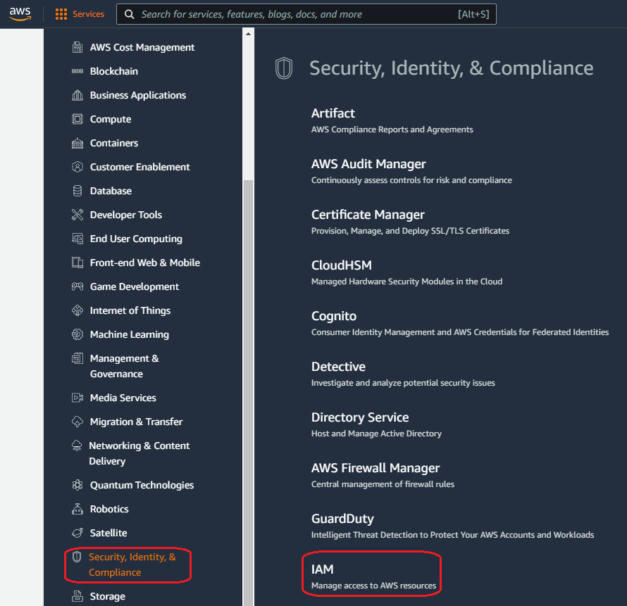
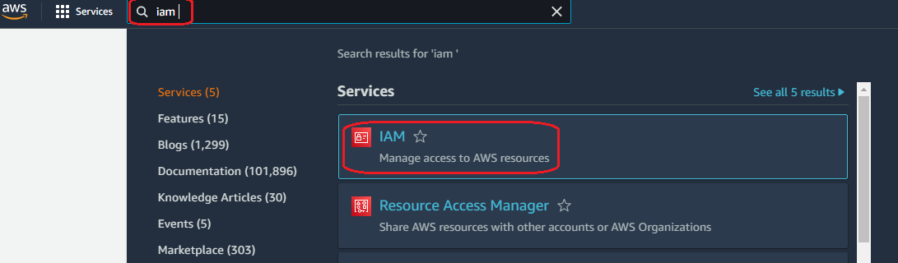
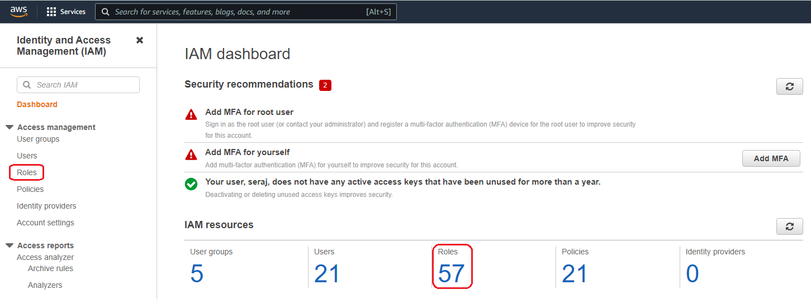
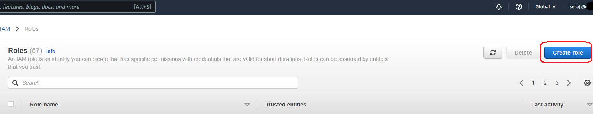
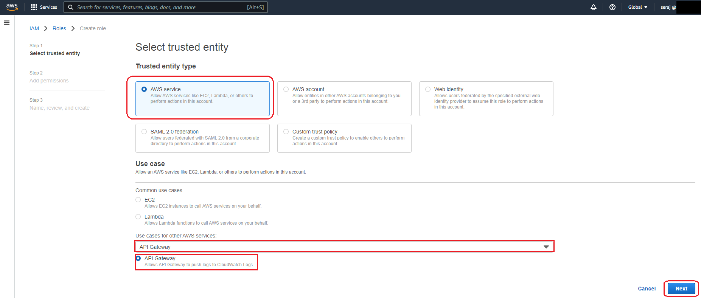

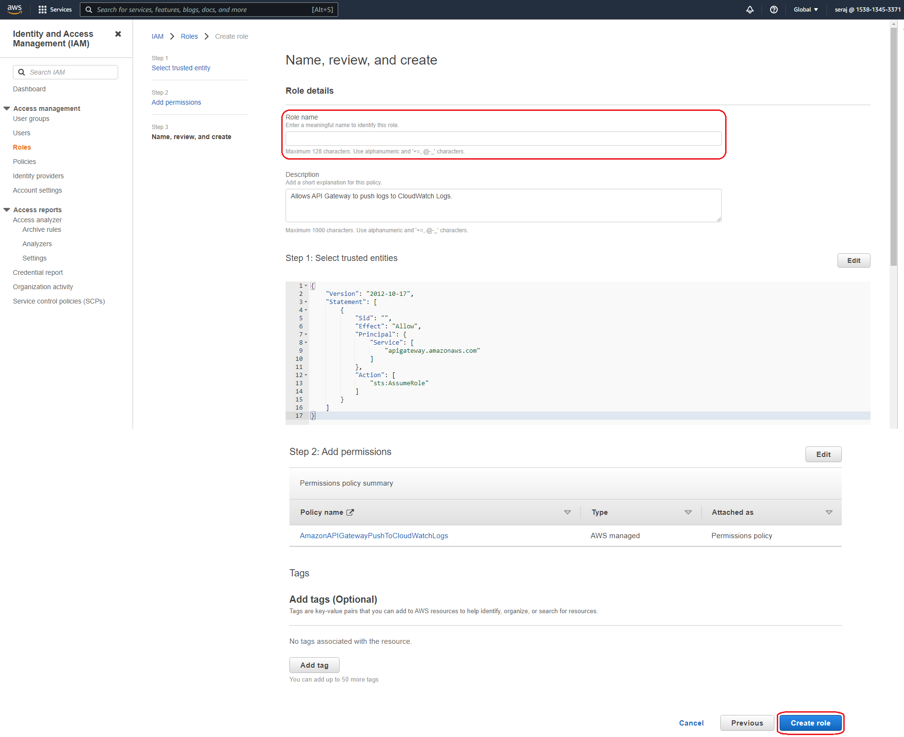
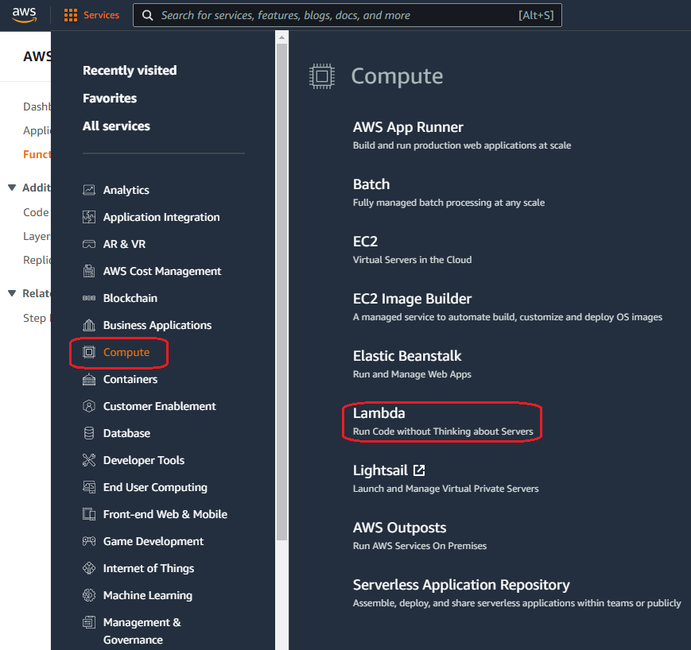
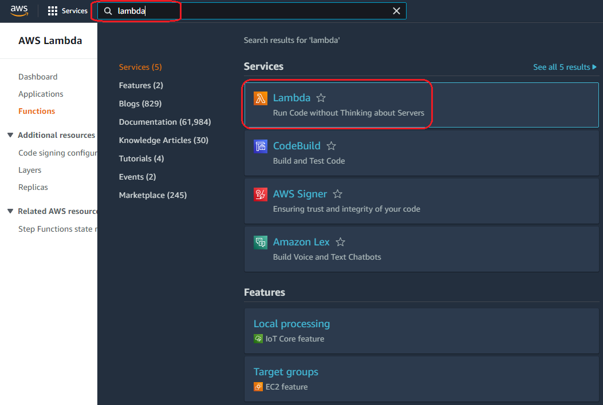
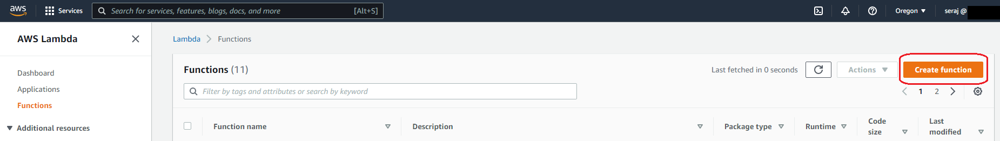
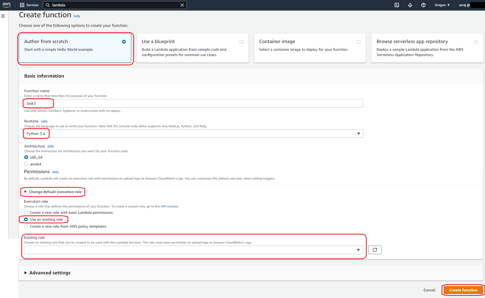
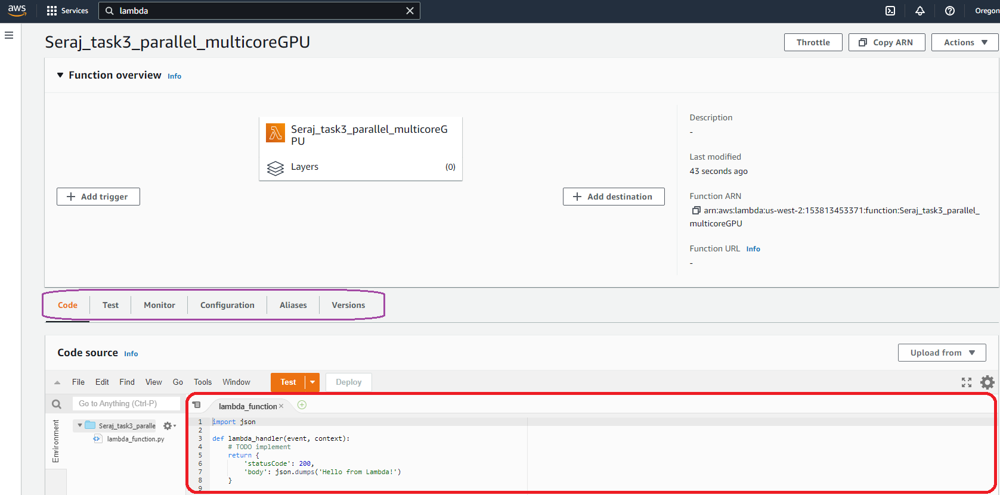
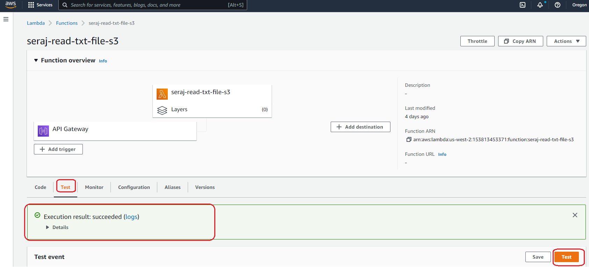
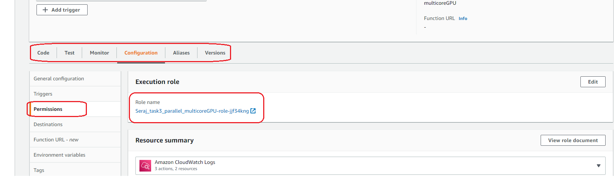
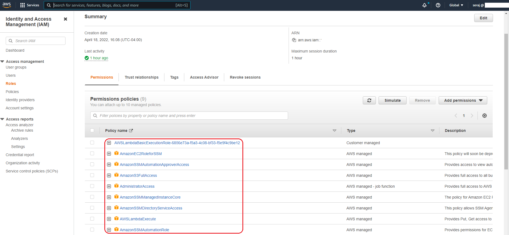

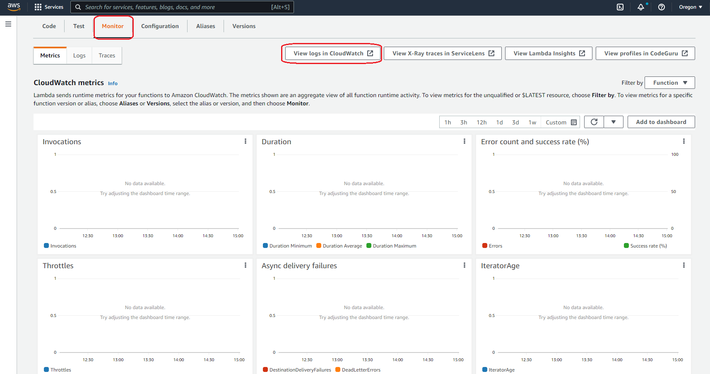
