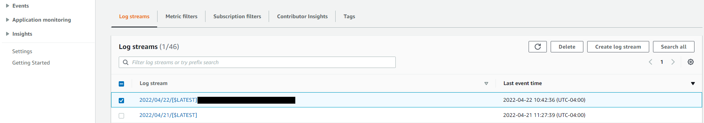
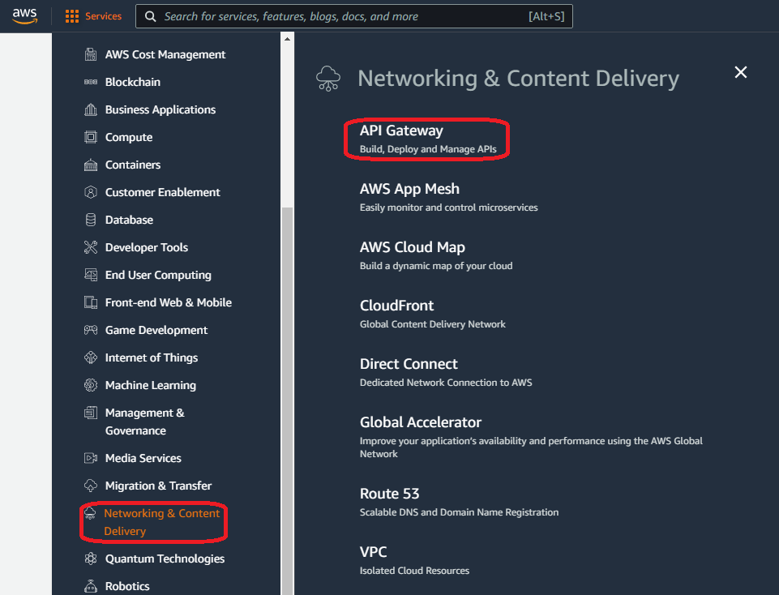

# How to Configure RESTFul links using AWS Lambda and API Gateway Services to launch EC2 application

Amazon API Gateway is an AWS service for creating, publishing, maintaining, monitoring, and securing REST, HTTP, and WebSocket APIs at any scale. 
In this tutorial we considered REST APIs. A REST (representational state transfer), also called RESTful API is an architectural style for an 
application program interface (API) that uses HTTP requests to access and use data. That data can be used to GET, PUT, POST and DELETE data types,
which refers to the reading, updating, creating and deleting of operations concerning resources.

### ***To accomplish this process we need to go through configuring three (3) aws services including IAM, Lambda and API Gateway in various steps. This tutorial provides step by step configuration guidline.***

## ***Login and choosing the region***

Go to **www.aws.amazon.com** to **sign in** to the console (on top right corner) using your credentials (username, password, etc.).
Once you are logged in, select the right **Region** (on top right corner) in which you want your deploy your desired services. If this is a new account, default region would work.

## ***Step1 IAM (Identity Access Management)***
### --IAM Dashboard--
Go to the **Services** (with 9 dots), click **Security, Identity & Compliance** and choose **IAM** on the right panel. Or, alternatively search for IAM and choose IAM from the services.

### --Create Role--
Now you are in the IAM dashboard where you can create a new role if you do not have one. Policies are attached to the Role to perform some specific tasks which we will allow you to have permissions to communicate between services. In this page click **Roles** on the left panel or in the middle and click **Create role** (blue button on the top right).

Select the entity type _(in this case it is **AWS Services**)_, next in the **Use Case** choose **API Gateway** as the use case service and select the **API Gateway** radio button, then click **Next** (blue button on the bottom right).

In this page we cannot add any policies to the IAM role just created. But we can attach all necessary policies while configuring the lambda function. So, you can just the **Next** (blue button on the bottom right) button. 

In **Role details**, enter a **Role name** and click **Create role** (blue button on the bottom right). You can leave everything st is. 

***We are done creating the **Role** which was the first step. Now we will move on to the next step which is configuring a lambda function!***

## ***Step2 LAMBDA Function***
###  --Create a Lambda function--

Choose Lambda from either servies (_services > Compute > Lambda_) or search for Lambda to go to the Lambda function page.

Select the **Create Function** (orange button on the top right).

In this page you can simply follow the image. First select **Author from scratch** as we are creating a new function, give a _unique_ function name, choose the run time (in this case we chose, Python 3.6), then go to the **Change default execution role** dropdown and select **Use an existing role**. In the **Existing role** dropdown select the **Role** you created in step 1. Finally click the **Create Function** (orange button on the bottom right).

***note:*** If you wanto use any previously created **role** you can simply skip Step1 and start from step2.

Now you are redirected to the Lambda console where you can deploy your code in the **Code Source** box. A sample code is given that prints __Hello From Lambda!__.

***optionally*** you can test this existing code by selecting **Test** from the menu and click orange **Test** button. If it succeeds it will show as ***Execution Result: Succeeded** otherwise throws error!

Let's click the **Configuration** from Menu and select **Permissions** on the left panel where you will find the Role name. You can click the Role (whatever your role is) to go to IAM page associated with this Role.

You will see if there are any policies attached to this role or you will see at least one role with **BasicExecutionRole**. Please note, the list of policies you can see in the following image are required for this task. So please add your policies as required by following the next step.

To attach a policy to to your role, click **Add Permissions** dropdown and select **Attach Policies**

Here you can type full policy name or a part of it (correcly) and hit return in your keyboard to display the policy. Select the policy (check box) and click **Attach Policies**.

This is how you can add all the policies you need. You can find on aws what types of policies you need for your services. Here are some list of polocies we used to communicate between the required services.

