# How to Create RESTFul Services using AWS Lambda and API Gateway Services to launch EC2 based execution

This document explains RESTFul service provisioning on top of AWS cloud services. If a user has a program/software that is executable on an AWS EC2 instance, this document shows step-by-step instructions on how to create RESTFul services so other users could run the program/software via HTTP GET/POST methods. The RESTFul services are created via AWS Lambda and API Gateway Services.

## _What is AWS Lambda Functionon:_
AWS Lambda is a serverless compute service that can run any sort of code without having to provision or manage servers. Lambda runs your code on highly available compute infrastructure and performs all of the administration of computing resources, capacity provisioning, automated scaling, monitoring, and logging.

## _What is AWS API Gateway:_
Amazon API Gateway is an AWS service for creating, publishing, maintaining, monitoring, and securing REST, HTTP, and WebSocket APIs at any scale. 
In this tutorial we considered REST APIs. A REST (representational state transfer), also called RESTful API is an architectural style for an 
application program interface (API) that uses HTTP requests to access and use data. That data can be used to GET, PUT, POST and DELETE data types,
which refers to the reading, updating, creating and deleting of operations concerning resources.

## _What is AWS EC2:_
Amazon EC2 (Elastic Compute Cloud) is a web-based service that allows businesses to run application programs in the AWS public cloud. EC2 enables developer to configure virtual machines (VMs) to provide compute capacity and workloads are distributed through global AWS data centers. EC2 is capable of increasing or decreasing instance capacity as needed.

## _This tutorial is about deployment of aws services that incorporates aws EC2 instance, Lambda function and API Gateway. We have pre-deployed deep learning application in EC2 which is triggered by a Lambda Function. API Gateway provides the link to call the Lambda function that triggers an event to run application on EC2._

### ***To accomplish this process we need to go through configuring three (3) aws services including IAM, Lambda and API Gateway in various steps. This tutorial provides step by step configuration guidline.***

## ***Login and selecting the region***

Go to **www.aws.amazon.com** to **sign in** to the console (on top right corner) using your credentials (username, password, etc.).
Once you are logged in, select the right **Region** (on top right corner) in which you want your deploy your desired services. If this is a new account, default region would work.

## ***Step1- IAM (Identity Access Management)***
### --IAM Dashboard--
Go to the **Services** (with 9 dots), click **Security, Identity & Compliance** and choose **IAM** on the right panel. Or, alternatively search for IAM and choose IAM from the services.

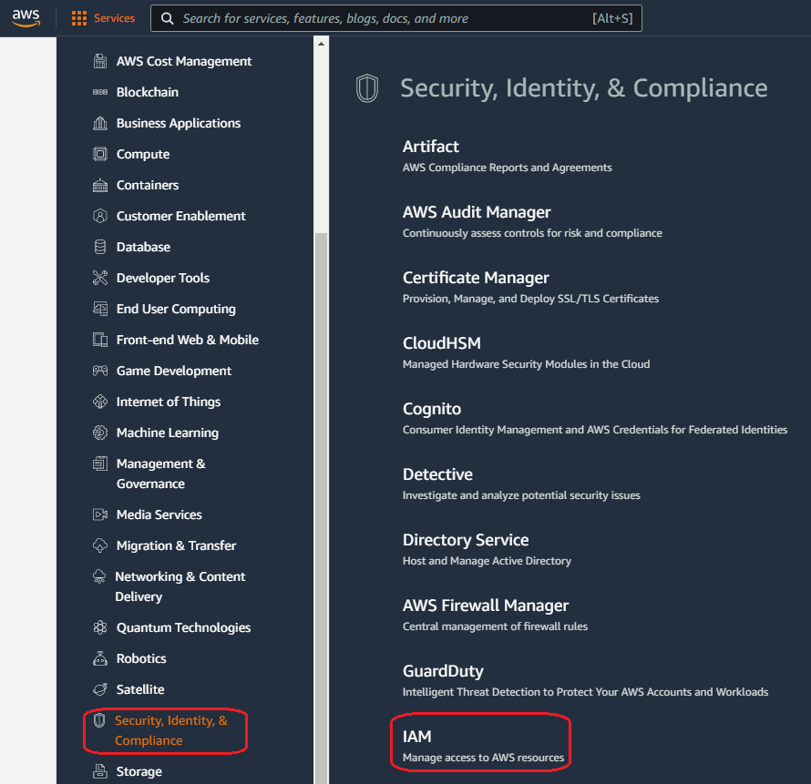


### --Create Role--
Now you are in the IAM dashboard where you can create a new role if you do not have one. Policies are attached to the Role to perform some specific tasks which we will allow you to have permissions to communicate between services. In this page click **Roles** on the left panel or in the middle and click **Create role** (blue button on the top right).


Select the entity type _(in this case it is **AWS Services**)_, next in the **Use Case** choose **API Gateway** as the use case service and select the **API Gateway** radio button, then click **Next** (blue button on the bottom right).


In this page we cannot add any policies to the IAM role just created. But we can attach all necessary policies while configuring the lambda function. So, you can just the **Next** (blue button on the bottom right) button. 


In **Role details**, enter a **Role name** and click **Create role** (blue button on the bottom right). You can leave everything st is. 

***We are done creating the **Role** which was the first step. Now we will move on to the next step which is configuring a lambda function!***

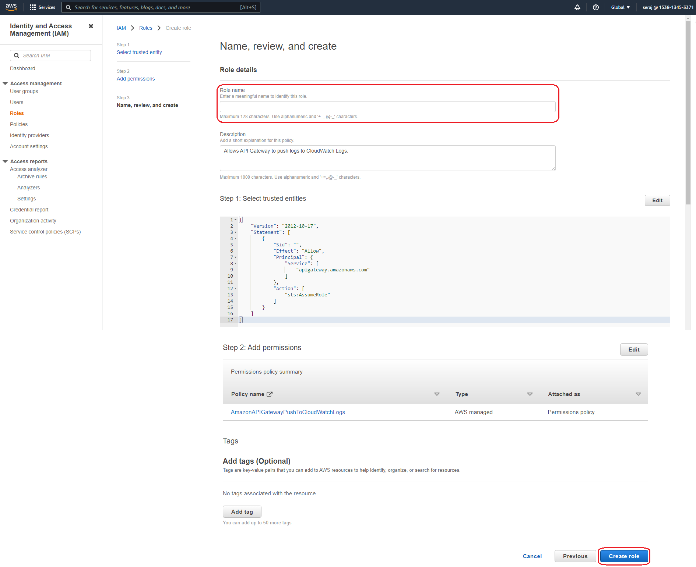

## ***Step2- Lambda Function***
###  --Create a Lambda function--

Choose Lambda from either servies (_services > Compute > Lambda_) or search for Lambda to go to the Lambda function page.


Select the **Create Function** (orange button on the top right).


In this page you can simply follow the image. First select **Author from scratch** as we are creating a new function, give a _unique_ function name, choose the run time (in this case we chose, Python 3.6), then go to the **Change default execution role** dropdown and select **Use an existing role**. In the **Existing role** dropdown select the **Role** you created in step 1. Finally click the **Create Function** (orange button on the bottom right).

***note:*** If you wanto use any previously created **role** you can simply skip Step1 and start from step2.


Now you are redirected to the Lambda console where you can deploy your code in the **Code Source** box. A sample code is given that prints __Hello From Lambda!__. However, the main codes are ```service_1_trigger_lambda_to_execute.py``` which is used to trigger a lambda event that executes the predefind model in EC2, and ```service_2_trigger_lambda_to_copy_files_to_S3.py``` is another event to copy the results files to a S3 bucket. 

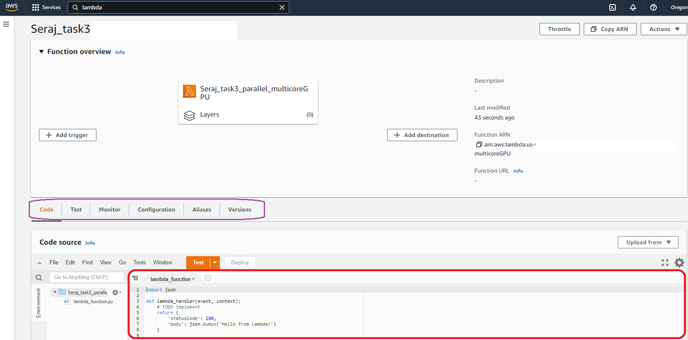

***optionally*** you can test this existing code by selecting **Test** from the menu and click orange **Test** button. If it succeeds it will show as ***Execution Result: Succeeded** otherwise throws error!

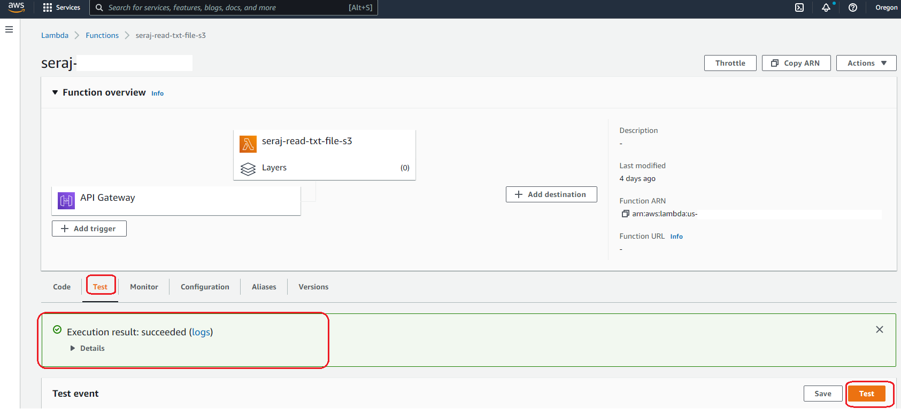

Let's click the **Configuration** from Menu and select **Permissions** on the left panel where you will find the Role name. You can click the Role (whatever your role is) to go to IAM page associated with this Role.


You will see if there are any policies attached to this role or you will see at least one role with **BasicExecutionRole**. Please note, the list of policies you can see in the following image are required for this task. To attach a policy to to your role, click **Add Permissions** dropdown and select **Attach Policies**.


Here you can type full policy name or a part of it (correcly) and hit return in your keyboard to display the policy. Select the policy (check box) and click **Attach Policies**. By the end of this, you are done with Lambda function creation and attachment of policies.


***Optionally*** if you want to see the logs of your execution in cloudwatch you can click **Monitor** from the Menu and click **View logs in CloudWatch**.


 It will take you to a new window with all logs by date and time.


## ***Step3- AWS API Gateway***
### --Create API--

Click the **Services** _(with 9 dots)_ and choose **Networking & Content Delivery** from the dropdown, then on the right panel you will see **API Gatway**. Alternatively, type **API Gateway** in the search box _(second image)_, click on the **API Gateway**.


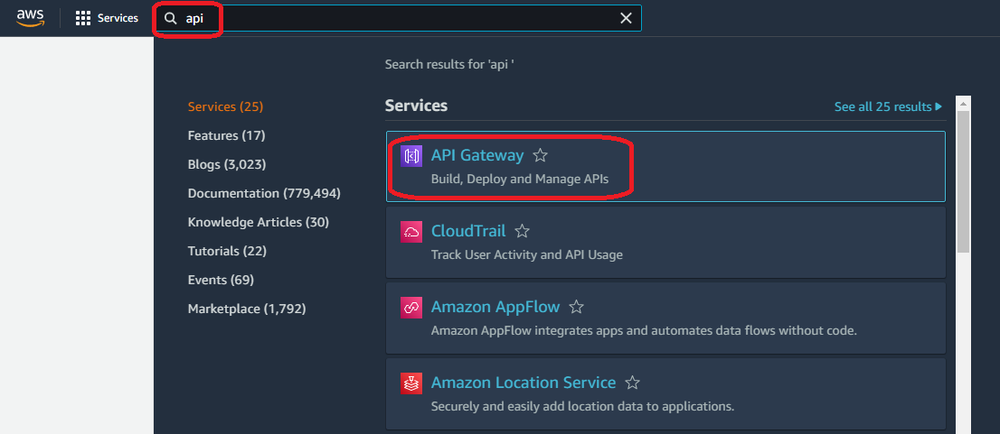

In this page, click the **Create API** button. 


At this point click **Build** from the **REST API** section.

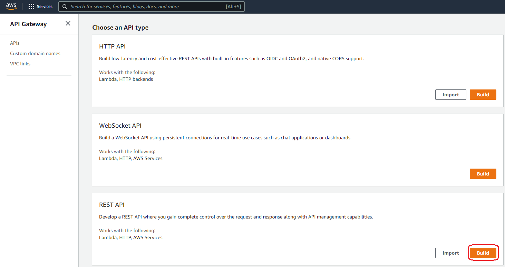

Now in this page, select **REST** from protocol, choose **New API** and then in the settings, enter an **API name**, description is optional, Endpoint Type is **Regional** as we are building regional services in our case. Finally click **Create API** on the bottom right (_blue button_).

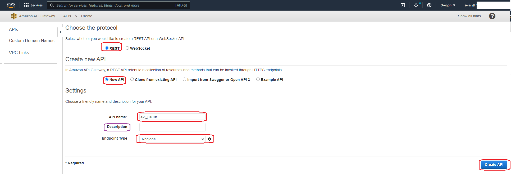

Now the API is created! Under **Resources** there will be a ***"/"*** where we need to add our Resources. From **Actions** select **Create Resource**.

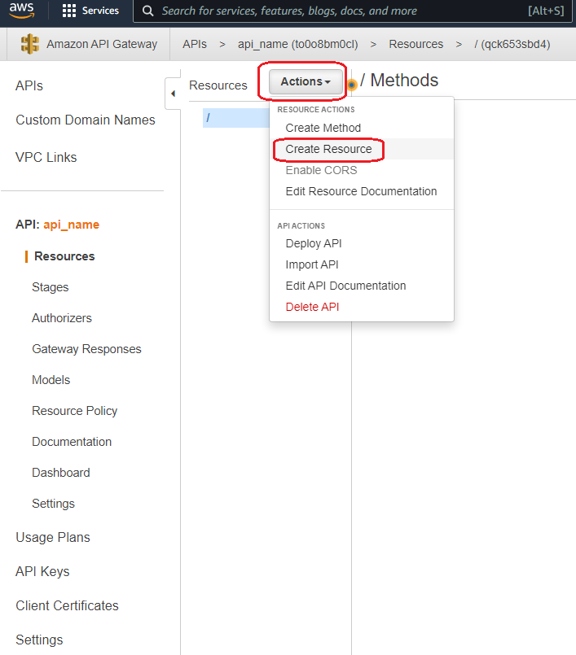

It will ask for a Resource Name, where you can put any name _(test, in our case)_, then click **Create Resource** button.


Now, Under the Resources the ***/test*** will appear. Select ***"/"test***, click **Actions** and click **Create Method**.

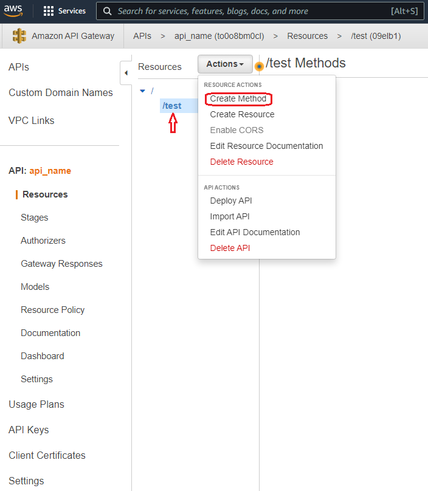

 It will display list of Methods from where you can chose **GET** and click the associated small **tick mark**.


At this point, we need to attach the Lambda function that we created earlier. To do so, choose, lambda Function from Integration type, select your right Region, then in the Lambda Function text box, start typing your Lambda funtion name, it will show you related functions, just choose the one you need for this task. Finally hit **Save** button.
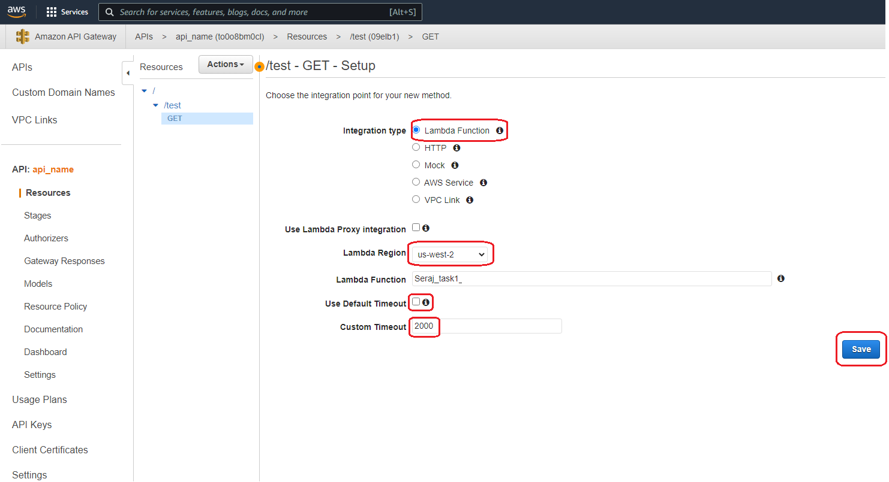

Once you clicked Save, it will pop-up the follwoing window askign about permission. Press **OK**.


Now the Lambda is connected to this API. The methods and asscociated Lambda is displayed here on the right panel. Now, we need to deploy the API. To do so, click **Actions** and then **Deploy API**.

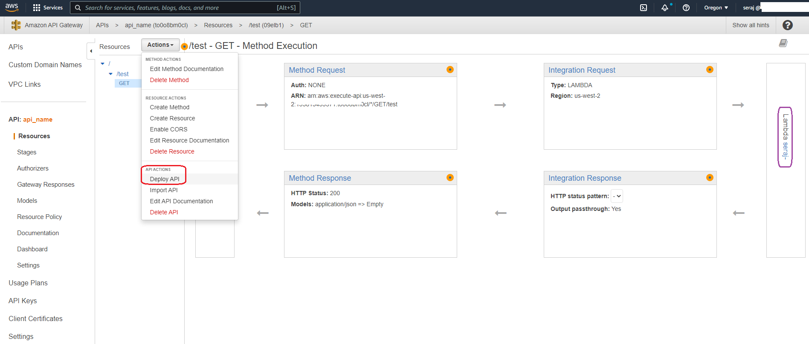

The new pop-up will ask for Deployment Stage, just select the **[New Stage]** and as a stage name you can choose anything (like _v1_). Hit **Deploy**.


At this point you will be able to see a link but we will not use this one but the other one!


On the Stage, click the **v1** dropdown and select **GET**, the API link will appear on the right pannel. This is our final API. You can just click it and it will do the job! For later use, you can save this link somewhere.


You can also go to your Lambda function and you will see now the API Gateway is details is here now. It means the API gateway can use this lambda function as a trigger.

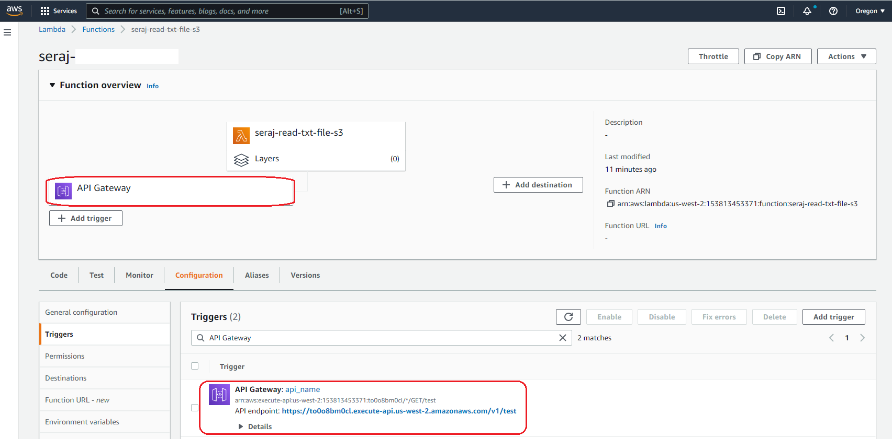

Finally, if you click or copy and paste the link to your browser you can see your desired action!


***We are all set!***
