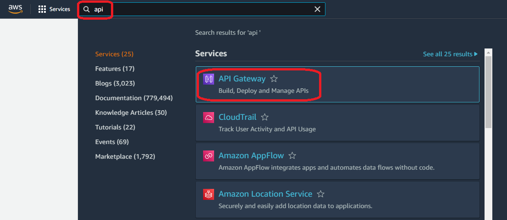
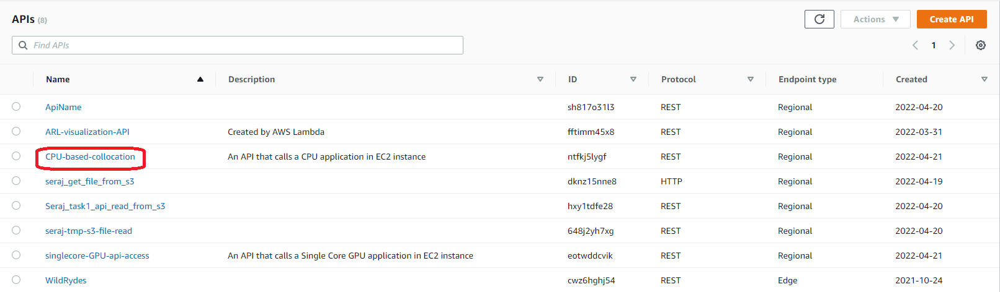
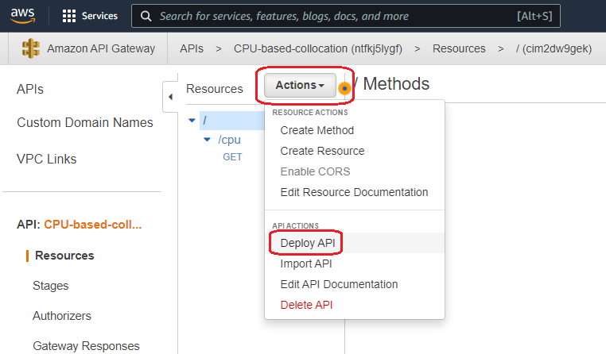
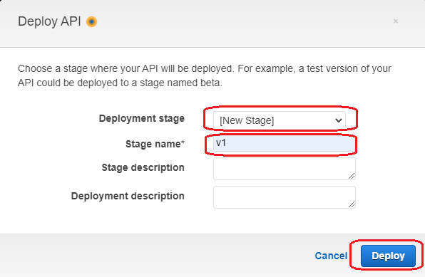
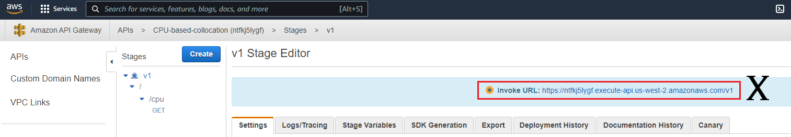
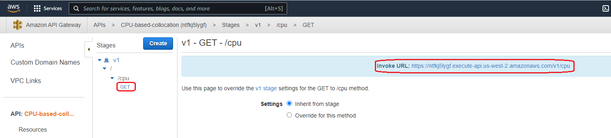

# How to get the RESTFul API links from AWS API Gateway Services

Amazon API Gateway is an AWS service for creating, publishing, maintaining, monitoring, and securing REST, HTTP, and WebSocket APIs at any scale. 
In this tutorial we considered REST APIs. A REST (representational state transfer), also called RESTful API is an architectural style for an 
application program interface (API) that uses HTTP requests to access and use data. That data can be used to GET, PUT, POST and DELETE data types,
which refers to the reading, updating, creating and deleting of operations concerning resources.

## Getting into API Gateway

Please follow the step-by-step instruction to Find your API. ***Your corresponding EC2 instance must be running***.
### Step1 ***-Sigining in!-***

First, go to **www.aws.amazon.com** then click **sign in** to the console (on top right corner). Use your credentials (username, password, etc.) to login to the aws console.

### Step2 ***-Select Region-***

Once you are logged in, you should select the right **Region** (on top right corner) to make sure you are using all other related services or your team are in the same region. If this is a new account, default region is okay but next services onwards should be in the same region.

### Step3 ***-Get to the API console-***

Click the **Services** _(with 9 dots)_ and choose **Networking & Content Delivery** from the dropdown, then on the right panel you will see **API Gatway**. Alternatively, type **API Gateway** in the search box _(second image)_, click on the **API Gateway**.

### Step4 ***-Find your API-***

Here all the available APIs are listed by region. From your region click on the API link you want to.

### Step5 ***-Deploy the API-***

In this page you jus need to **click Actions** and then **Deploy API**. A new box will appear asking the deployment stage _(second image)_, select **[New Stage]** and you can put any **Satge name**. In our case we chose _v1_. Then hit the **Deploy** button. Now there will be a link on top saying **Invoke  URL** which can be used but we will use the complete URL can be found by clicking the **GET** method (follow the images).
***note:*** Deploying the API again and again will give you the same URL. So you can save the URL at some place then you do not need to deploy this. Plesae make sure the corresponding EC2 instance is running.

***Congratulations! You have a working API***
